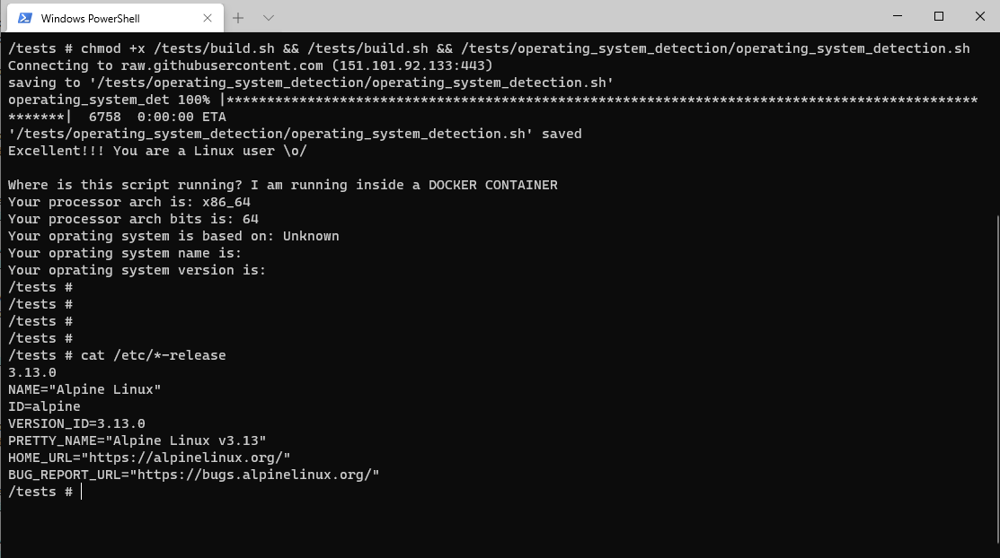
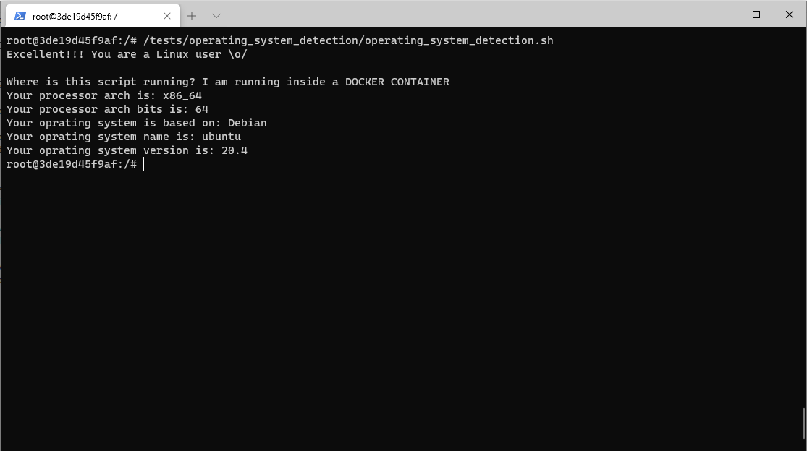

# Docker

For those whom run Docker containers...

## Source code

Once you are inside the Docker container, copy and past the commands to get the operating system informations.

### Alpine

-  <!--Not working correctly yet-->

1. Create and get inside the Alpine container
    > $ `docker run -it --name my_alpine alpine`

1. Commands

    ```bash
    #Update the system
    apk update

    #Install Bash
    apk add bash

    #Use Bash
    bash

    #Run the fastest mode
    clear && rm -fr ./build.sh /operating_system_detection/ && wget https://raw.githubusercontent.com/henrikbeck95/operating_system_detection/main/tests/build.sh --no-check-certificate -O build.sh && ls && chmod +x ./build.sh && ./build.sh && ./operating_system_detection/operating_system_detection.sh --print
    ```

<!--
### ArchLinux

1. Create and get inside the ArchLinux container
    > $ `docker run -it --name my_archlinux archlinux`

1. Commands

    ```bash
    #Update the system and install cURL
    packman -Syu && pacman -S curl

    #Create the folder and get in there
    mkdir /tests/ && cd /tests/

    #Download the shell script file
    curl https://raw.githubusercontent.com/henrikbeck95/operating_system_detection/main/tests/build.sh --output build.sh

    #Give executable permission and run it 
    chmod +x /tests/build.sh && /tests/build.sh && /tests/operating_system_detection/operating_system_detection.sh
    ```
-->

### Fedora

1. Create and get inside the Fedora container
    > $ `docker run -it --name my_fedora fedora`

1. Commands

    ```bash
    #Update the system
    dnf update

    #Install Wget
    dnf install wget

    #Run the fastest mode
    clear && rm -fr ./build.sh /operating_system_detection/ && wget https://raw.githubusercontent.com/henrikbeck95/operating_system_detection/main/tests/build.sh --no-check-certificate -O build.sh && ls && chmod +x ./build.sh && ./build.sh && ./operating_system_detection/operating_system_detection.sh --print
    ```

### Gentoo

1. Create and get inside the Slackware container
    > $ `docker run --name my_gentoo -it gentoo/stage3`

1. Commands

    ```bash
    #Run the fastest mode
    clear && rm -fr ./build.sh /operating_system_detection/ && wget https://raw.githubusercontent.com/henrikbeck95/operating_system_detection/main/tests/build.sh --no-check-certificate -O build.sh && ls && chmod +x ./build.sh && ./build.sh && ./operating_system_detection/operating_system_detection.sh --print
    ```

### Mageia

1. Create and get inside the Slackware container
    > $ `docker run --name my_mageia -it mageia`

1. Commands

    ```bash
    #Update the system
    urpmi.update
    dnf update

    #Install Wget
    #urpmi wget
    dnf install wget

    #Run the fastest mode
    clear && rm -fr ./build.sh /operating_system_detection/ && wget https://raw.githubusercontent.com/henrikbeck95/operating_system_detection/main/tests/build.sh --no-check-certificate -O build.sh && ls && chmod +x ./build.sh && ./build.sh && ./operating_system_detection/operating_system_detection.sh --print
    ```

### Slackware

1. Create and get inside the Slackware container
    > $ `docker run -it --name my_slackware vbatts/slackware`

1. Commands

    ```bash
    #Run the fastest mode
    clear && rm -fr ./build.sh /operating_system_detection/ && wget https://raw.githubusercontent.com/henrikbeck95/operating_system_detection/main/tests/build.sh --no-check-certificate -O build.sh && ls && chmod +x ./build.sh && ./build.sh && ./operating_system_detection/operating_system_detection.sh --print
    ```

### Ubuntu

- 

1. Create and get inside the Ubuntu container
    > $ `docker run -it --name my_ubuntu ubuntu`

1. Commands

    ```bash
    #Run the fastest mode
    clear && rm -fr ./build.sh /operating_system_detection/ && wget https://raw.githubusercontent.com/henrikbeck95/operating_system_detection/main/tests/build.sh --no-check-certificate -O build.sh && ls && chmod +x ./build.sh && ./build.sh && ./operating_system_detection/operating_system_detection.sh --print
    ```